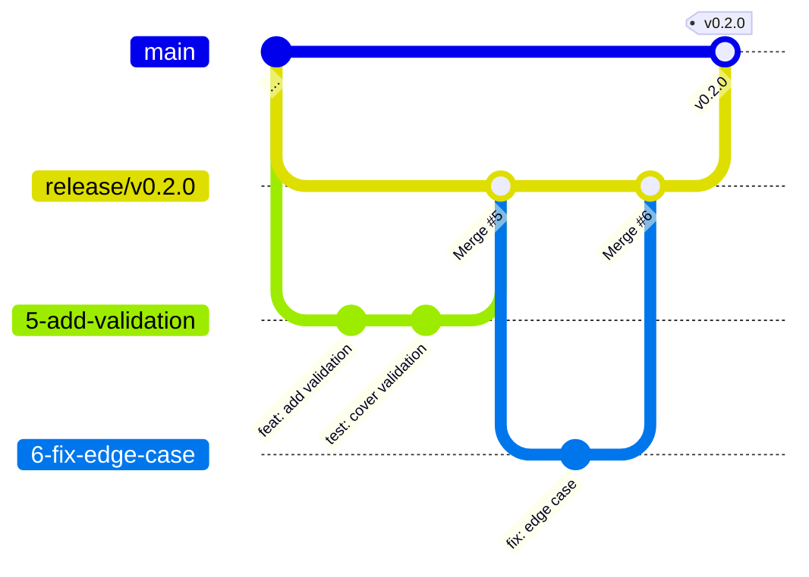

# Contributing to idem

This document describes the contribution process for idem. This package follows
tidyverse conventions for code style and workflow — see the
[tidyverse development contributing guide](https://rstd.io/tidy-contrib) and
[code review principles](https://code-review.tidyverse.org/) for broader context.

## Before you start

File an issue before writing any code. This ensures the change is needed and
avoids wasted effort. If you have found a bug, include a minimal
[reprex](https://www.tidyverse.org/help/#reprex) in the issue — this makes it
easier to diagnose and to write a unit test later. The tidyverse guide on
[how to create a great issue](https://code-review.tidyverse.org/issues/) has
useful advice.

## Prerequisites

The following tools must be available on your `PATH` before following the
contribution workflow. Install them once and they will work across all
projects.

### uv

[uv](https://docs.astral.sh/uv/getting-started/installation/) is a Python
package manager used to install the other tools:

```sh
# macOS / Linux
curl -LsSf https://astral.sh/uv/install.sh | sh
```

See the [uv installation guide](https://docs.astral.sh/uv/getting-started/installation/)
for Windows and other options.

### pre-commit

[pre-commit](https://pre-commit.com/) runs the hook scripts before each
commit. Install it via uv (recommended):

```sh
uv tool install pre-commit
```

Alternatives: `pip install pre-commit` or `brew install pre-commit`.

### air

[air](https://posit-dev.github.io/air/) is the R code formatter used by the
`air-format` hook. Install it via uv (recommended):

```sh
uv tool install air-formatter
```

Alternatives: `pip install air-formatter` or `brew install air-formatter`.

## Branching model

This repository uses a **release-branch workflow**:

1. A `release/vX.Y.Z` branch is created by a maintainer for each planned
   release.
2. Each piece of work (feature, fix, docs, etc.) gets its own branch cut
   **from the target release branch**, named `<issue-number>-brief-description`
   (e.g. `7-improve-contributing-guide`).
3. Completed feature branches are merged into the release branch via a pull
   request. All CI checks must pass before merging.
4. When a release is ready, the release branch is merged into `main`. The merge
   commit is tagged with the version number (e.g. `v0.2.0`).

Maintainers create and manage release branches. If you are an external
contributor, check whether an active release branch exists and target your PR
there. If none exists, ask in your issue which branch to use.



## Contribution workflow

### 1. Fork and clone

Fork the repository and clone it locally. The easiest way is:

```r
usethis::create_from_github("impact-initiatives/idem", fork = TRUE)
```

Or with plain git:

```sh
git clone https://github.com/<your-username>/idem.git
cd idem
git remote add upstream https://github.com/impact-initiatives/idem.git
```

### 2. Install dependencies and verify the baseline

```r
devtools::install_dev_deps()
devtools::check()
```

R CMD check must pass cleanly before you make any changes. If it does not,
open an issue rather than continuing.

### 3. Create a branch

Create your branch **from the active release branch**:

```r
usethis::pr_init("7-brief-description-of-change")
```

Or with plain git:

```sh
git fetch upstream
git checkout -b 7-brief-description-of-change upstream/release/vX.Y.Z
```

### 4. Make changes and commit

Follow the [commit message format](#commit-message-format) described below.
Each commit should be a coherent, self-contained unit of work. The PR as a
whole should address just one thing — see the tidyverse guide on
[focused PRs](https://code-review.tidyverse.org/author/focused.html).

### 5. Push and open a PR

When ready, push and open a PR:

```r
usethis::pr_push()
```

Or with plain git:

```sh
git push -u origin 7-brief-description-of-change
```

Then open a pull request on GitHub. The PR title must briefly describe the
change. The PR body must contain `Fixes #<issue-number>`.

## Pre-commit hooks

[Pre-commit hooks](https://pre-commit.com/) are tests that run each time you
attempt to commit. If the tests pass, the commit will be made, otherwise not.

This repository uses [pre-commit](https://pre-commit.com/) to run automated
checks before each commit. The hook scripts are not committed to the
repository — every contributor must install them locally after cloning. The
steps below are **required, not optional**: without them the hooks will not run.

### 1. Install the precommit R package and activate the hooks

The [`precommit`](https://lorenzwalthert.github.io/precommit/) R package
provides a convenient way to install the pre-commit framework and activate
the hooks from R. Run the following in an R session from the root of the
cloned repository:

```r
install.packages("precommit")
precommit::use_precommit()
```

`precommit::use_precommit()` writes the hook scripts into `.git/hooks/`. The
pre-commit framework must already be installed — see
[Prerequisites](#prerequisites) if you have not done so yet. You only need to
run this once per clone.

### 2. Activate the commit-msg hook

By default, the `precommit` R package only activates the `pre-commit` hook,
which runs checks on your code before each commit. Other hooks, like
`commit-msg` to validate commit messages, must be activated separately.
Activate it with one additional command in your terminal:

```sh
pre-commit install --hook-type commit-msg
```

Run this command from the root of the cloned repository.

This hook enforces the [Conventional Commits](https://www.conventionalcommits.org/)
format — see [Commit message format](#commit-message-format) below for the
rules and allowed types.

### 3. Install air

The `air-format` hook requires the `air` binary on your `PATH` — see
[Prerequisites](#prerequisites) if you have not installed it yet.

### Run hooks manually

To run all hooks against every file without making a commit:

```sh
pre-commit run --all-files
```

To run a single hook by its id:

```sh
pre-commit run <hook-id> --all-files
# e.g.
pre-commit run lintr --all-files
```

### Hook reference

| Hook | What it checks / does |
|---|---|
| `roxygenize` | Rebuilds `man/` and `NAMESPACE` from roxygen2 tags |
| `use-tidy-description` | Sorts and normalises `DESCRIPTION` fields |
| `spell-check` | Spell-checks documentation and vignettes |
| `lintr` | Lints R source for style and potential issues |
| `readme-rmd-rendered` | Ensures `README.md` is up-to-date with `README.Rmd` |
| `parsable-R` | Verifies all `.R` files parse without error |
| `no-browser-statement` | Blocks accidental `browser()` calls |
| `no-print-statement` | Blocks accidental `print()` calls |
| `no-debug-statement` | Blocks accidental `debug()`/`debugonce()` calls |
| `deps-in-desc` | Ensures every used package is declared in `DESCRIPTION` |
| `pkgdown` | Validates the pkgdown site configuration |
| `check-added-large-files` | Blocks files larger than 200 KB |
| `file-contents-sorter` | Keeps `.Rbuildignore` entries sorted |
| `end-of-file-fixer` | Ensures files end with a newline |
| `air-format` | Auto-formats R code to the tidyverse style via Air |
| `conventional-pre-commit` | Enforces Conventional Commits format on commit messages |
| `forbid-to-commit` | Blocks `.Rhistory`, `.RData`, `.Rds`, `.rds` files |

### Commit message format

The `conventional-pre-commit` hook enforces the
[Conventional Commits](https://www.conventionalcommits.org/) specification.
Every commit message must start with a type prefix:

```
type: short description in the imperative mood
```

Types used in this repository:

| Type | When to use |
|---|---|
| `feat` | A new feature or behaviour |
| `fix` | A bug fix |
| `docs` | Documentation changes only |
| `refactor` | Code change that neither fixes a bug nor adds a feature |
| `test` | Adding or updating tests |
| `chore` | Maintenance tasks (dependency updates, config changes, etc.) |

Example: `feat: add validate_choices() function`

Commits that do not follow this format will be rejected by the hook.

## Code style

- New code must follow the [tidyverse style guide](https://style.tidyverse.org).
  The `air-format` hook applies this automatically on commit — do not restyle
  code that is unrelated to your change.

- To format manually before committing:

  ```sh
  air format .
  ```

  Or format a single file:

  ```sh
  air format R/my_file.R
  ```

- To lint R source files:

  ```r
  lintr::lint_package()
  ```

- This package uses [roxygen2](https://cran.r-project.org/package=roxygen2) with
  [Markdown syntax](https://roxygen2.r-lib.org/articles/rd-formatting.html)
  for all documentation. After editing roxygen2 comments, regenerate the docs:

  ```r
  devtools::document()
  ```

- This package uses [testthat](https://cran.r-project.org/package=testthat) (v3) for
  unit tests. Contributions that include test cases are easier to accept.
